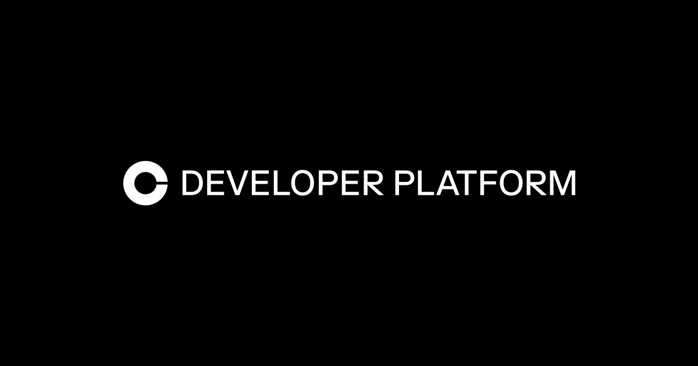

# 🚀 Email-to-Wallet Waitlist Template 

**Turn every email signup into a crypto wallet.** No seed phrases, no MetaMask, no crypto knowledge required.

Built with [CDP Embedded Wallets](https://docs.cdp.coinbase.com/embedded-wallets/welcome) to showcase how Web3 can feel exactly like Web2. Your users just enter their email and get OTP verification - they'll never know they just created a crypto wallet.

[](https://portal.cdp.coinbase.com/)
[](https://github.com/Must-be-Ash/email-wallets)
[](https://emailwallets.com)



---

## ⚡ Quick Start (5 Minutes)

1. **[🔑 Get Your Free CDP API Keys](https://portal.cdp.coinbase.com/)** - Start building in 30 seconds
2. **[🌐 Add Your Domain](https://portal.cdp.coinbase.com/products/embedded-wallets/domains)** - Add `http://localhost:3000` for development  
3. **Fork & Clone** this repo
4. **Set Environment Variables** (see `.env.example`)
5. **Deploy** - You're now collecting wallet addresses from email signups!

```bash
git clone https://github.com/Must-be-Ash/email-wallets
cd waitlist-cdp
npm install
cp .env.example .env.local
# Add your CDP keys to .env.local
npm run dev
```

**✅ That's it!** Your waitlist now creates crypto wallets for every email signup.

---

## 🌍 Why This Changes Everything

### **The Problem Every Developer Faces**
- Users hate complicated signups with passwords and verification emails
- International payment processing is expensive and restricted  
- Building user authentication and payment systems takes months
- Traditional wallets scare away 90% of potential users

### **The CDP Solution**
- **Email = Wallet**: Users just enter email + OTP. No seed phrases, no browser extensions
- **Global by Default**: Accept users from any country, no payment processor restrictions
- **5-Minute Integration**: Add one component, get complete wallet functionality
- **Feels Like Web2**: Users never know it's crypto - it just works like any modern app

```tsx
// This is all you need - CDP handles everything else
<WaitlistForm onSuccess={(walletAddress) => {
  // User just created a crypto wallet with their email
  console.log('New wallet created:', walletAddress);
}} />
```

---

## 🚀 What You Can Build With Email + Wallet Magic

**Now that you can collect emails AND wallet addresses simultaneously, here's what becomes possible:**

### 🎁 **Launch & Early Supporter Rewards**
- **Automatic NFT Airdrops**: Email signup = instant early supporter NFT to their new wallet
- **Token Presales**: Email waitlist gets exclusive presale instructions with wallet ready to receive
- **Founder's Pass NFTs**: First 100 signups get special founder NFTs with future utility
- **Early Access Tokens**: Automatically send governance tokens to early community members

### 🌟 **Community Building with Ownership**
- **Proof of Interest**: Every email signup is also a wallet holder (instant community ownership)
- **Engagement Rewards**: Send tokens/NFTs for newsletter opens, referrals, social shares
- **Community Governance**: Email subscribers can vote with tokens you've airdropped
- **Exclusive Drops**: Target future NFT/token launches to your email+wallet database

### 🔮 **Web2 → Web3 Onboarding Experiments** 
- **Invisible Web3**: Users think they joined a waitlist, but they're now Web3-ready
- **Progressive Disclosure**: Start with familiar email flow, gradually introduce Web3 features
- **Zero-Friction Adoption**: No "Connect Wallet" barriers - they already have one
- **Cross-Chain Opportunities**: Use email for communication, wallet for multi-chain interactions

### 🎯 **Targeting Web2 Users with Web3 Backend**
- **Seamless Crypto Integration**: Accept crypto payments from users who don't know it's crypto
- **Global Reach**: Serve users in countries traditional payment processors can't reach
- **Instant Settlement**: Get paid in 90 seconds instead of 7-14 days
- **Future-Proof Database**: When Web3 adoption grows, your users are already ready

**💡 The Experiment:** You now have both communication channels (email) AND on-chain identity (wallet) for every user. What interesting combinations can you build?

---

## ✨ The "Invisible Web3" Experience

**Your users experience this flow:**
1. Enter email address (like any modern app)
2. Enter 6-digit OTP from email (familiar 2FA flow)  
3. Join waitlist (just got a crypto wallet + they don't know it)

**What actually happened behind the scenes:**
- ✅ Created non-custodial crypto wallet
- ✅ Secured with email-based authentication  
- ✅ Ready for global payments and Web3 features
- ✅ Works on mobile, desktop, any browser
- ✅ No seed phrases, no MetaMask, no crypto knowledge needed

```typescript
// Your users see this UX:
"Enter your email" → "Check your email for code" → "Welcome to the waitlist!"

// But they actually just:
// 1. Created a non-custodial wallet
// 2. Received their first wallet address  
// 3. Can now receive crypto payments globally
// 4. Ready for Web3 features you'll add later
```

---

## 🛠️ What's Included

### ✅ **Complete Wallet Infrastructure**
- **Email-based Authentication**: No seed phrases or complex onboarding
- **OTP Verification**: Familiar 2FA flow users already know
- **Non-custodial Wallets**: Users own their keys (with Coinbase security)
- **Mobile-First**: Works flawlessly on all devices without browser extensions

### ✅ **Production-Ready Foundation**
- **Next.js 14**: App Router with TypeScript for type safety
- **MongoDB**: Duplicate email prevention and user management  
- **Notion Integration**: Waitlist data synced to your Notion workspace
- **Email System**: Welcome emails via Resend with custom templates

### ✅ **Enterprise Features**
- **Rate Limiting**: Prevent abuse with built-in MongoDB-based throttling
- **Error Handling**: Graceful failure handling and user feedback
- **Security**: Authentication middleware and input validation
- **Scalable**: Handles millions of signups out of the box

### ✅ **Developer Experience**
- **TypeScript**: Full type safety across the entire application
- **Component Library**: Reusable UI components with shadcn/ui
- **Animation System**: Smooth interactions with Framer Motion
- **Responsive Design**: Mobile-first UI that works everywhere

---

## 🔧 Configuration

### **Required Environment Variables**

```bash
# ==============================================================================
# 🔑 CDP (Coinbase Developer Platform) - GET THESE FIRST!
# ==============================================================================
# 1. Sign up FREE at: https://portal.cdp.coinbase.com/
# 2. Create a project and copy your Project ID
# 3. Add your domain at: https://portal.cdp.coinbase.com/products/embedded-wallets/domains
NEXT_PUBLIC_CDP_PROJECT_ID=your_cdp_project_id_here

# ==============================================================================
# 📧 OPTIONAL - Additional Services (Waitlist Features)
# ==============================================================================
# Notion integration for waitlist management
NOTION_SECRET=your_notion_secret
NOTION_DB=your_notion_database_id

# Email system for welcome messages  
RESEND_API_KEY=your_resend_api_key

# MongoDB for duplicate prevention and rate limiting
MONGODB_URI=your_mongodb_connection_string
```

**⚡ The CDP Project ID is all you need to get started!** The other services add waitlist-specific features but aren't required for wallet creation.

---

## 🌟 What Makes CDP Embedded Wallets Special

### **🎯 For Your Users (Zero Learning Curve)**
- **Email Login**: Just like every app they use - no crypto education needed
- **Works Everywhere**: Any device, any browser, mobile-first experience  
- **Instant Access**: From landing page to wallet creation in under 60 seconds
- **Global Reach**: Works in 100+ countries without payment restrictions
- **Bank-Like Security**: Powered by Coinbase's institutional-grade infrastructure

### **⚡ For You (The Developer)**
- **5-Minute Integration**: Drop in components and hooks - no blockchain expertise required
- **React-Native**: Built for modern React developers with TypeScript support
- **Zero Maintenance**: No wallet compatibility issues or browser extension dependencies  
- **Enterprise Scale**: Handles millions of users on Coinbase's infrastructure
- **Compliance Included**: KYC/AML, fraud detection, and policy controls built-in

### **🚀 The Strategic Advantage**
- **Higher Conversion**: Email signup vs. "Connect Wallet" - 10x better conversion rates
- **Global Market**: Accept users from countries Stripe/PayPal can't serve
- **Future-Proof**: Start with email signups, add Web3 features when ready
- **Viral Growth**: Users invite friends easily - no crypto barrier to entry
- **Platform Moat**: Once users have wallets, they're sticky to your ecosystem

---

## 📊 Real Business Impact

### **Before CDP Embedded Wallets:**
- 😰 "Connect your MetaMask wallet" → 90% drop-off rate
- 🌍 Geographic restrictions limit your market
- 💳 Payment processing fees eat 3-5% of revenue  
- 🛠️ Months building authentication and payment systems
- 📱 Mobile users can't participate (no browser extensions)

### **After CDP Embedded Wallets:**
- ✅ "Enter your email" → Familiar flow, high conversion
- 🌍 Global reach - accept users from anywhere
- 💰 Pennies in transaction fees on Base network
- ⚡ 5-minute integration gets you wallet infrastructure
- 📱 Mobile-first experience that works everywhere

---

## 🚀 Fork This → Build Your Vision

**This template proves a concept: Web3 that feels like Web2 actually works.**

Every fork creates new possibilities:
- **Fork + Customize** for your industry (fitness, education, art, consulting)
- **Add Payment Features** using the wallet addresses you're collecting
- **Build Community Features** around the wallets your users own
- **Create Token Rewards** for early adopters and engagement  
- **Launch Global Services** without payment processor restrictions

### **Your Next Steps:**
1. **[🔑 Get Free CDP Keys](https://portal.cdp.coinbase.com/)** - Takes 30 seconds
2. **[🌐 Configure Your Domain](https://portal.cdp.coinbase.com/products/embedded-wallets/domains)** - Add localhost + production URL
3. **🍴 Fork This Template** - Your foundation is ready
4. **🎨 Customize for Your Niche** - Change branding, add features  
5. **🚀 Deploy & Scale** - You're now creating wallets from email signups

---

## 💡 Success Stories Waiting to Happen

**The developers who succeed with this template won't be crypto companies - they'll be normal businesses using better infrastructure:**

- **Fitness Coaches** selling workout plans to global audiences
- **Educators** monetizing courses without geographic restrictions  
- **Content Creators** receiving tips from fans worldwide instantly
- **Consultants** accepting payments from international clients
- **SaaS Founders** charging for API usage with micropayments
- **Community Builders** rewarding members with tokens they actually own

---

## 🤝 Community & Resources

### **Get Started**
- 📖 **[CDP Documentation](https://docs.cdp.coinbase.com/)** - Complete integration guides
- 🔑 **[CDP Portal](https://portal.cdp.coinbase.com/)** - Get your free API keys
- 💬 **[CDP Discord](https://discord.com/invite/cdp)** - Developer community support

### **Follow the Journey**  
- 🐦 **[CDP Twitter](https://x.com/coinbasedev)** - Latest updates and announcements
- 🎥 **[Builder Tutorials](https://x.com/Must_be_Ash)** - See what others are building
- 📺 **[Success Stories](https://x.com/coinbasedev)** - Real businesses using this approach

---

## 🎯 Ready to Turn Emails Into Wallets?

**The magic isn't the crypto - it's making crypto invisible.**

Every email signup becomes a wallet. Every wallet becomes an opportunity. Every opportunity becomes a global business.

**[🔑 Get Your Free CDP API Keys](https://portal.cdp.coinbase.com/) → [🍴 Fork This Template](https://github.com/Must-be-Ash/email-wallets) → 🚀 Build the Future**

---

*Built with [CDP Embedded Wallets](https://www.coinbase.com/developer-platform) - crypto infrastructure that feels like Web2.*
